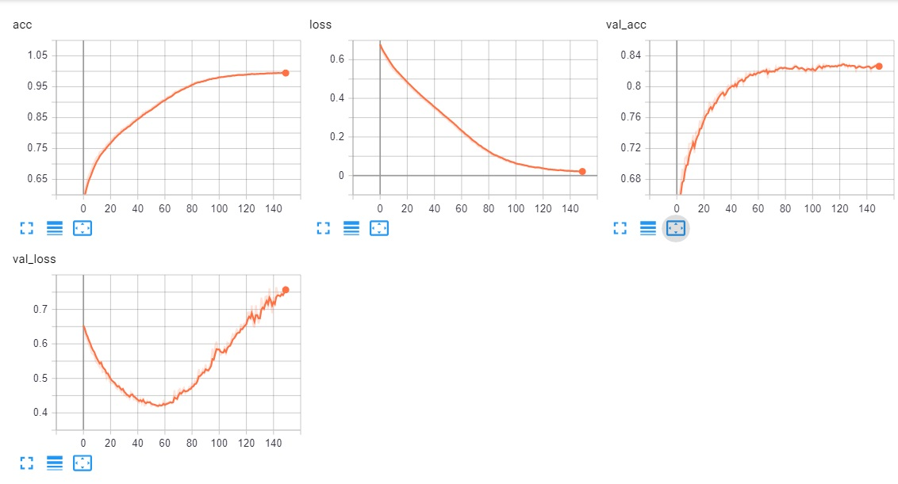
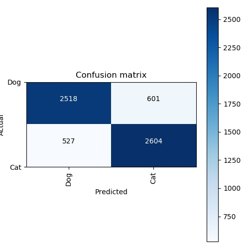
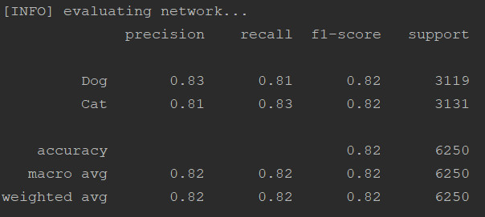
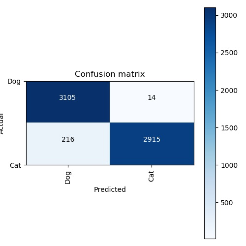
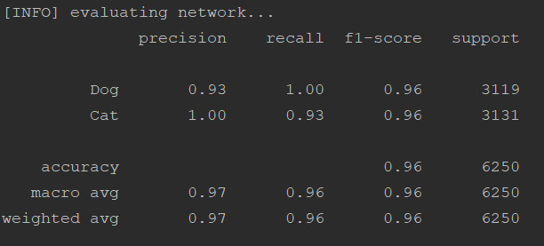
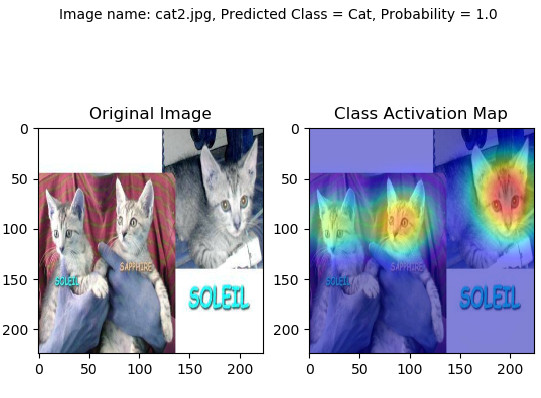
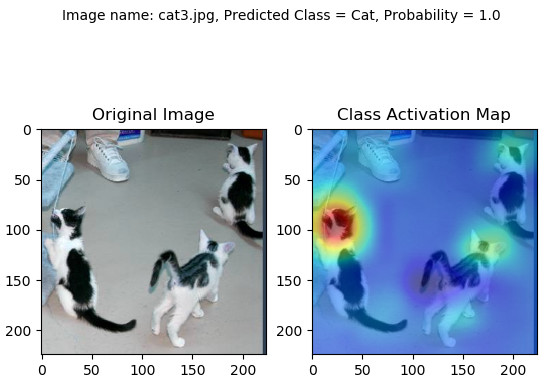
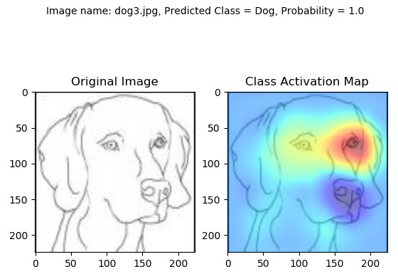
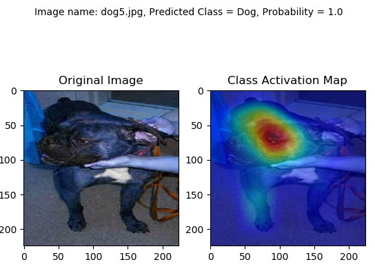

# Dogs_vs_Cats
A sample project to classify images of cats and dogs 

## Folder Structure
- dogs_vs_cats
  - src
    - simple_cnn.ipynb
    - simple_cnn.py

  - pre_trained_models
    - *downloaded files for the choosen pre-trained model will come here* 
  - data
    - train
      - *Annotations for your images will come here*
      - *all of your images will come here* 
    - test
	  - Test 
        - *all your images for testing will come here*	  
	  - Train 
		- *Annotations for your training images will come here*
		- *all of your images for training will come here*	  
	  - Validation
        - *Annotations for your validation images will come here*
        - *all of your images for validation will come here*
    - labels.npy
    - data.npy

   - models
     - *inference graph of the trained model will be saved here*
   - training
     - *checkpoints of the trained model will be saved here*
   - config
     - *config file for the choosen model will come here*
   -testimages
    -result of testing will come here*

	

## Setup to use dogs_vs_cats repository 

## Explore Different Training
Build a Custom Training:
If you want to build a custom training run simpletraining.py
simple_cnn.py loads all the dogs and cats images in memory without any image augmentaion.

Transfer Learning: 
If you do not have enough memory to load all the data in memory use XXX.py

If you are intersted in transfer learning run transfer_learning.py

## Code Explanation
- Define global variables:
- prepare_data:
In simple_cnn.py, the whole images in the dataset are loaded in memory. All the images are resized to a given size. There is no image augmentation in this step. 

- define_model: Define the model architecture.

- training: training process is set, adding checkpoints to save the best model, tensorboard logging for visualization , early stopping, ... .

- predict: load the model and run it on the test data.

- main: depend on the user input, runs the training or the prediction function. 

## How to run the code

python object_detection/legacy/train.py --logtostderr --train_dir=<path_to_the folder_for_saving_checkpoints> --pipeline_config_path=<path_to_config_file>

Checkpoints will be saved in training folder. 

## Training results

The model is then fit and evaluated, which takes approximately 1 hour on modern GPU hardware.

Your specific results may differ given the stochastic nature of the learning algorithm.

In this case, we can see that the model achieved an accuracy of about 82% on the validation dataset as shown in the following figure.

Reviewing this figure, we can see that the model has overfit the training dataset at 60 epochs.

## Class Activation Map
Using keras pre-trained model of VGG_16.

- Example 1:

- Example 2:

- Example 3:

- Example 4:

