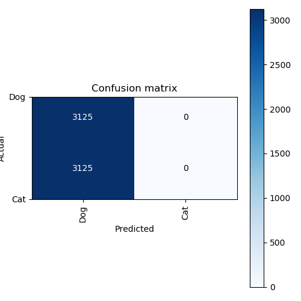
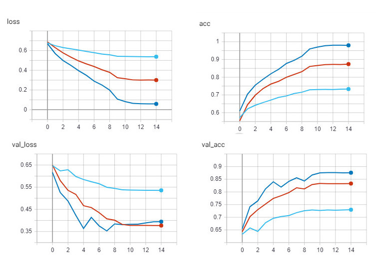
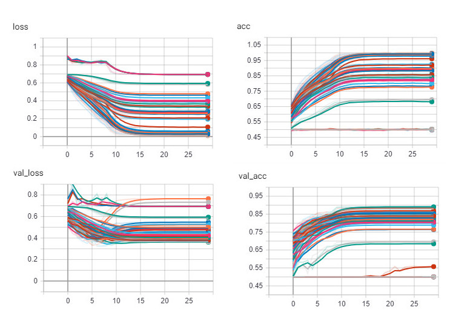

# Dogs_vs_Cats
A sample project to classify images of cats and dogs 

## Folder Structure
- dogs_vs_cats
  - src
    - cam.py
    - simple_cnn.py
    - config.py
    - main.py
    - util.py
    - data_prepration.py
  - data
    - train
      - *Annotations for your images will come here*
      - *all of your images will come here* 
    - test
    - labels.npy 
    - data.npy

   - models
     - *inference graph of the trained model will be saved here*

	

## Setup to use dogs_vs_cats repository 

## Explore Different Training
Build a Custom Training:
If you want to build a custom training run simple_cnn.py loads all the dogs and cats images in memory without any image augmentaion.

Transfer Learning: 
If you do not have enough memory to load all the data in memory use XXX.py

If you are intersted in transfer learning run transfer_learning.py

## Code Explanation
- config.py: Define global variables.
- data_prepration.py: Preprocess the train data for training.
- main.py: Depend on the user input, run the training or the prediction function.
- util.py: Contains utility functions used during training or prediction.
- simple_cnn.py: Build a model from scratch. 
- cam.py: Build calss activation map.

## How to run the code

python DeepLearning_Tensorflow/dogs_vs_cats/src/main.py 
Checkpoints will be saved in  DeepLearning_Tensorflow/dogs_vs_cats/model folder. 

## Training results

The model is then fit and evaluated, which takes approximately 1 hour on modern GPU hardware.

Your specific results may differ given the stochastic nature of the learning algorithm.

In this case, we can see that the model achieved an accuracy of about 82% on the validation dataset as shown in the following figure.

Reviewing this figure, we can see that the model has overfit the training dataset at 60 epochs.

## Class Activation Map
Using keras pre-trained model of VGG_16.

- Example 1:

- Example 2:

- Example 3:

- Example 4:

## Hyper Parameter Tuning:

In order to increase the accuracy of our model, we did a grid search on some of the parameters such as learning rate, and kernel initializer functions.

We also introduced a learning rate scheduler that as the epoch increases, slows down the learning rate so the model converges. Our initial experiments showed that with a learning rate of 0.1 the model diverges and do not learn anything as shown below:
with the learning rates [0.1(orange), 0.01(dark blue), 0.001(red), 0001(light blue)]

Training logs of grid serach on 4 learning rates:

The classification results of learning rate 0.1:

Training logs after removing the learning rate 0.1:

In the next experiment we consider the initial learning rates of [0.01, 0.001]. After the epoch ?, the learning rate scheduler reduces the learning rate by 0.1 every 5 epochs.

The other hyper parameters that we investigate:

Learning rates: [0.01, 0.001]

Activation function: [swish, tanh, leakyrelu, relu]

kernel initializer: ['he_uniform','glorot_uniform','lecun_uniform']

Bias initializer: [0.0, 0.01]

Training logs of grid serach:

