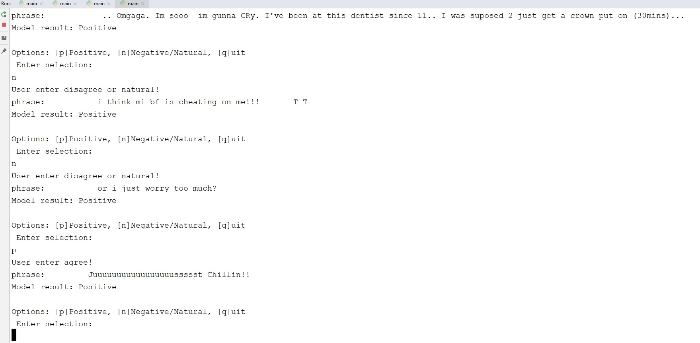

# IMDB sentiment analysis
This project is a simple chatbot application based on naive bayes bag of words representation of words.

## Folder Structure
- imdb_sentiment_analysis
  - src
    - util.py
    - naive_bayes
      - main.py
      - tester.py
      - train.py

  - data
     - data_prepration.py aftre cleaning and tokenizing the data of IMDB Dataset will generate the following files:
        - test_data.npy
        - test_labels.npy
        - train_data.npy
        - train_labels.npy      
   - models
     - *Inference graph of the trained model will be saved here*
   - doc
     - Useful tutorials and links can be found here

## Code Explanation
- util.py
- naive_bayes
    - main.py
    - tester.py
    - train.py
 
## How to run the code
python DeepLearning_Tensorflow/imdb_sentiment_analysis/src/naive_bayes/main.py 

Checkpoints will be saved in DeepLearning_Tensorflow/imdb_sentiment_analysis/model folder. 

## Training results
### Naive bayse project:

Naive bayse model trains and evaluates on CPU. The confusion matrix is shown in the following image. The accuracy of the model is 72% on validation dataset.

User feedback integeration:
User feedbacks are stored in a csv file for re-training the model.

