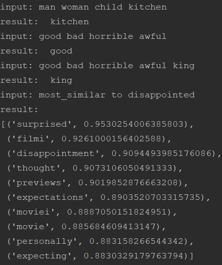
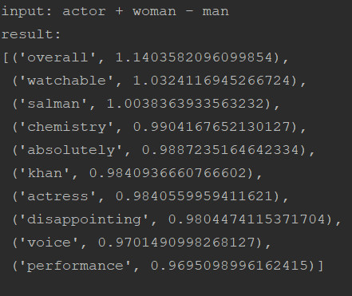

# IMDB sentiment analysis
This project consists  of 2 sub-projects. One is a simple chatbot application based on naive bayes bag of words representation of words.
The second project is using deep learning technology and word embeddings.

## Folder Structure
- imdb_sentiment_analysis
  - src
    - util.py
    - naive_bayes
      - main.py
      - tester.py
      - train.py
    - word_embeddings
      - main.py
      - build_model.py
      - build_word2vec_model.py
      - data_prepration.py
      - train.py
      - config.py

  - data
     - data_prepration.py aftre cleaning and tokenizing the data of IMDB Dataset will generate the following files:
        - test_data.npy
        - test_labels.npy
        - train_data.npy
        - train_labels.npy      
   - models
     - *Inference graph of the trained model will be saved here*
   - doc
     - Useful tutorials and links can be found here

## Code Explanation
- util.py
- naive_bayes
    - main.py
    - tester.py
    - train.py
 - word_embedding
    - main.py
    - build_model.py
    - build_word2vec_model.py
    - data_prepration.py
    - train.py
   - config.py: Define global variables.
  
## How to run the code
python DeepLearning_Tensorflow/imdb_sentiment_analysis/src/naive_bayes/main.py 
python DeepLearning_Tensorflow/imdb_sentiment_analysis/embeddings/main.py 

Checkpoints will be saved in DeepLearning_Tensorflow/imdb_sentiment_analysis/model folder. 

## Training results
### Naive bayse project:

Naive bayse model trains and evaluates on CPU. The confusion matrix is shown in the following image. The accuracy of the model is 72% on validation dataset.

User feedback integeration:
User feedbacks are stored in a csv file for re-training the model.

### Word embbeding project:
The configuration of word2vec embbeding:
 - num_features = 10  # Word vector dimensionality
 - min_word_count = 40  # Minimum word count
 - num_workers = 4  # Number of threads to run in parallel
 - context_window = 10  # Context window size
 - downsampling = 1e-3  # Downsample setting for frequent words

The two following figures show some of the anologies of word2vec word embbeding on IMDB dataset using the above cofiguration.

